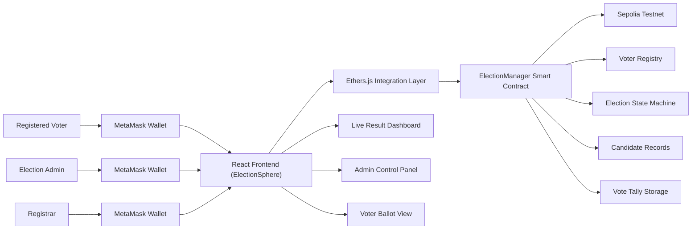

# Architecture Diagram

## Explanation

- MetaMask authenticates users through wallet ownership.
- React frontend offers admin, registrar, and voter workflows.
- Ethers.js handles read/write operations against the deployed contract.
- Smart contract stores election state, candidate list, voter approvals, and vote counts on-chain.
- Result charts render live tallies from blockchain state.
